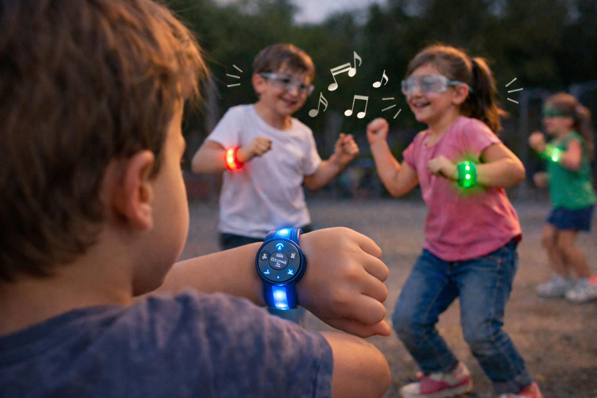

# CONNEX
Armband die blinde en slechtziende kinderen helpt elkaar te vinden op de speelplaats en samen spelen stimuleert.

🛠️ Built by ``Marie De Clercq`` & ``Janne Swijsen``   
🔥 Supervised by ``prof. dr. Bas Baccarne``, ``Yannick Christiaens`` & ``Wouter Devriese``    
🌱 Grown at ``Ghent University`` 🏛️ ``Industrial Design Engineering`` ([project overview](https://github.com/basbaccarne/human-centered-design))       

*21/01/2026 van de laatste update*   

## Samenvatting

Blinde en slechtziende kinderen ervaren moeilijkheden op de speelplaats. Uit interviews met volwassenen die blind of slechtziend zijn, blijkt dat zij dit probleem vroeger ook ondervonden. Een belangrijk probleem is het terugvinden van elkaar op de speelplaats. Dit werd bevestigd door toezichthouders van een buso-school die meerdere keren werd bezocht. Vooral kinderen met CVI hebben het moeilijk om andere kinderen te herkennen en doen dit vaak op basis van uiterlijke kenmerken zoals een jas. Ook voor volledig blinde kinderen is dit niet evident.
Daarnaast bleek uit interviews dat vier van de vijf blinde en slechtziende kinderen geen spelletjes spelen op de speelplaats. Dit toont aan dat het voor hen moeilijk is om samen te spelen en met elkaar te interageren.
Onze oplossing is de Connex, een armband die kinderen helpt elkaar te vinden en samen te spelen. De armband heeft drie ringen die via vibraties richting aangeven: links, rechtdoor en rechts, en wordt gebruikt wanneer een kind een vriendje zoekt. Slechtziende kinderen kunnen elkaar ook herkennen via ingebouwde lichtjes, waarbij elke armban een specifieke kleur heeft. Daarnaast bevat de armband knopjes waarmee kinderen samen geluid kunnen maken en een ingebouwde walkie talkie waardoor de kinderen draadloos met elkaar kunnen commmuniceren. Op deze manier worden spel en interactie met elkaar op de speelplaats gestimuleerd.

  

## Introductie

Blinde en slechtziende kinderen zijn een zeer kleine en specifieke doelgroep met zo’n 2300 tot 2500 kinderen in ons land [^1]. Tijdens het opgroeien is het belangrijk dat je als kind sociaal wordt uitgedaagd door leeftijdsgenoten. Kortom, je leert als kind heel veel bij tijdens het interageren met elkaar [^3]. Dit lijkt zeer vanzelfsprekend maar niet voor kinderen met een visuele beperking. Zij missen namelijk veel signalen die nodig zijn voor een vlotte communicatie. Zij kunnen geen lichaamsbewegingen lezen en kunnen zich sneller uitgesloten voelen bij visuele of fysieke activiteiten. Daarom is er onderzocht en verdiept in de wereld van blinde en slechtziende kinderen van zes tot twaalf jaar op school. Hoe ervaren zij de wereld en op welke manier lossen zij bepaalde zaken op? Een van de belangrijkste vragen: 'Hoe kunnen wij als ontwerper de interacie tussen de kinderen op de speelplaats stimuleren?'.

Al snel kwam naar voren dat navigatie en onderlinge activiteiten een gebrek waren op de speelplaats. Kinderen kunnen zich snel vervelen en hebben vaak moeite met elkaar te vinden op de speelplaats. Dit leidt voor velen tot eenzame pauzes en weinig interactie met leeftijdsgenoten wat een negatieve invloed heeft op de sociale ontwikkeling van kinderen. Daarom werd gezocht naar oplossingen, deze werden vertaald naar fysieke en interactieve prototypes. Dit geheel vormt de Connex, een interactieve en slimme armband die de sociale ontwikkelingen stimuleert door op een efficiëntere manier met elkaar te communiceren. Elk kind beschikt over een armband met een specifieke kleur waardoor slechtziende kinderen elkaar makkelijker kunnen vinden d.m.v. licht of trillingen. Ook bevat het talloze triggers zoals geluid, stemmetjes en zelfs een walkie-talkie om draadloos te communiceren met elkaar. 
Op deze manier zal dit product blinde en slechtziende kinderen tijdens hun jeugd optimalere ontwikkelingskansen bieden.

## Inhoudstafel

1. [Methodologie](./docs/methodologie.md)
2. [Discovery](./docs/discovery.md)
3. [Defintion](./docs/definition.md)
4. [Develop 1](docs/develop_1.md)
5. [Design Requirements](./docs/design_requirements.md)
6. [Bill of materials](./docs/bom.md)

## Kritische reflectie
##### Discovery
Het moeilijkste deel van de discovery is het begin: Welk probleem word er aangepakt? Op welke manier kunnen blinde en slechtziende mensen geholpen worden met het toekomstig product? Naar eigen mening is er daar te lang stilgestaan. Er waren zo veel uitlopende probleemdomeinen en dus ook heel uitlopende persona’s. 
Daarnaast verliep het vinden van personen voor interviews heel moeilijk. Het moeilijke aan een doelgroep als deze is dat je niet zomaar een paar kennissen hebt die in het profiel passen. Nog drie interviews proberen plannen op de overige korte tijd was bijna onmogelijk. Er waren heel wat facebookgroepen, maar deze beheerders antwoordden niet, hoewel forms hierin mochten.
Uiteindelijk is het wel goedgekomen en werd de “Connected Bracelets” bedacht. Ook daar bleek keuzes maken moeilijk en heb waren er wat dingen weggelaten, zoals de ringen. Vooral omdat het heel moeilijk is om je voor te stellen in het leven van een blinde of slechtziende persoon. Je wilt geen foute assumpties maken. Toch mag het resultaat er zijn.

##### Definition
In de definition fase bleek het enorm belangrijk om alle keuzes zoals de vorm en de functies goed te onderbouwen. Het is een zeer kleine doelgroep waardoor het nog moeilijker was deze te bereiken. Hierdoor werden er moeilijkheden ervaren op het begin van deze fase bij het grondig definiëren van het product. Daarom was het in dit geval zeer belangrijk om convergerend te werken. Denk in eerste instantie zeer ruim om vervolgens na elke user tests zaken te kunnen uitsluiten. 

De context van ons product lag vooraf al vast. Het product moet vooral buiten op de speelplaats gebruikt worden. Hierdoor konden al enkele vormen van het product gedefinieerd worden, alsook al dan niet gevalideerd in de user tests. Deze waren zeer nuttig en leverden veel inzicht de wereld van blinde en slechtziende kinderen. Door met de doelgroep te interageren en ze te analyseren is het als ontwerper makkelijker om de hoofdfuncties te gaan bepalen. 
Dit was zeer goed gelukt. Er bleek al snel dat navigatie op de speelplaats en dus het vinden van elkaar een groot probleem was voor vele kinderen. Ook het interageren met elkaar en samen spelen was niet evident. Hierdoor was het duidelijk wat het product moest kunnen. 
De functies vertalen naar prototypes was zeer goed gelukt. Door gebruik te maken van de aangeboden materialen konden deze op een optimale manier getest worden bij de gebruikers. 

Een grote moeilijkheid was de maximale vorm. Door met een armband te werken voor kinderen zit je met een beperkte ruimte. Hierdoor was het belangrijk om goed na te denken over de hoofd- en deelfuncties en goed te filteren wat echt een must is en wat een nice to have is. Ook nadenken over het integreren van de elektronica binnen een kleine ruimte speelde een rol. Wat is er mogelijk binnen het prototypen om een zo goed mogelijk product neer te zetten dat zo dicht mogelijk aansluit bij het werkelijke?

## Noot inzake het gebruik van AI
Ai werd gebruikt om onze teksten te herschrijven.
Prompts die gebruikt werden zijn: 
 - Herschrijf deze tekst naar ... woorden.
 - Herschrijf deze tekst naar een meer academische langere tekst.
 - Herschrijf volgende kernpunten naar een tekst met volzinnen.
 
 In de Github context kwam er ook een promt bij:
 - Zet volgens Excell bestanden om in naar tabellen voor Github.

## Bijlagen
### Discovery
* Literatuuronderzoek (N=12)
  * [Protocol](https://docs.google.com/document/d/1pLS-yoIyCixUsoDy8Olxq0LtLZL6geReQaMbVEoXSQo/edit?usp=sharing)
  * [Rapport](https://docs.google.com/document/d/1AL9Oe7OtSYR5j-e9NTBCdWoD_j0to6DTz_V7ykQryFg/edit?usp=sharing)
* Interviews (N=3)
  * [Protocol](https://docs.google.com/document/d/1lNR8YfhxGHRlNQWdzrdml9-akHI-udctF2etSMvRUCo/edit?usp=sharing)
  * [Rapport](https://docs.google.com/document/d/16wcM5seSrV6ImXd_zJ5tbA79aMq7ztIV8XGaAGufvN0/edit?usp=sharing)
    
### Definition
* User testing wave 1 (N=5)
  * [Protocol](https://docs.google.com/document/d/1PScToasmRdA7CPwijmAdqm3Sq7c3n27H3kJ8hwbPWeM/edit?usp=sharing)
  * [Rapport](https://docs.google.com/document/d/1yzAaIJYupc4RvSSkkgK8SMXgZm30wgphqNSSNsJLy3I/edit?usp=sharing)
* User testing wave 2 (N=5)
  * [Protocol](https://docs.google.com/document/d/1tHmsLacJP1s_fwc3OeXYuKpickdQvcC8EyfVEBEWJOY/edit?usp=sharing)
  * [Rapport](https://docs.google.com/document/d/1i3CbX1E0wDJPAPWbUhM5ELafk3zNrf05KD8DWR6aCic/edit?usp=sharing)

### Develop 1
  * User testing wave 1 (N=5)
  * [Protocol]
  * [Rapport]
* User testing wave 2 (N=5)
  * [Protocol]
  * [Rapport]

## Licentie

This repository contains both software and design materials created as part of an industrial design energineering project at Ghent University.

- **Software and code:** [MIT License](./LICENSE-MIT)  
- **Design, documentation, CAD, and media:** [CC BY 4.0 License](./LICENSE)
  
You are free to reuse and build upon this work, both commercially and non-commercially, as long as proper attribution is given to the original authors.

## Bronnen
[^1]: Statbel – Nationaal Instituut voor de Statistiek., (2025). Kerncijfers 2025 (PDF). Belgische Federale Overheidsdienst Economie 

[^2]: Wibra. (z.d.). Fietslampjes LED 2 stuks – rood/wit

[^3]: Ince, D., & Kalthoff, H. (2020). Opgroeien en opvoeden: Normale uitdagingen voor kinderen, jongeren en hun ouders (Nederlands Jeugdinstituut). Nederlands Jeugdinstituut.
