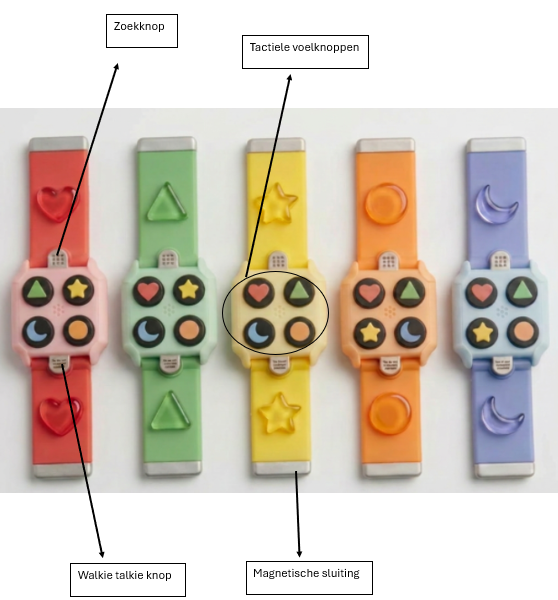
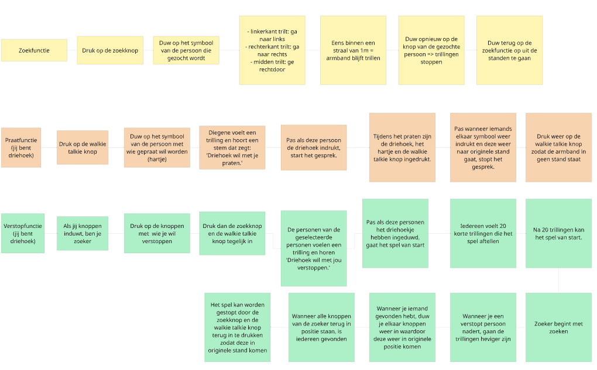
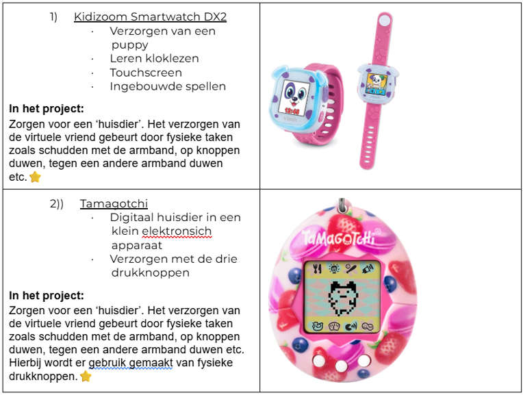
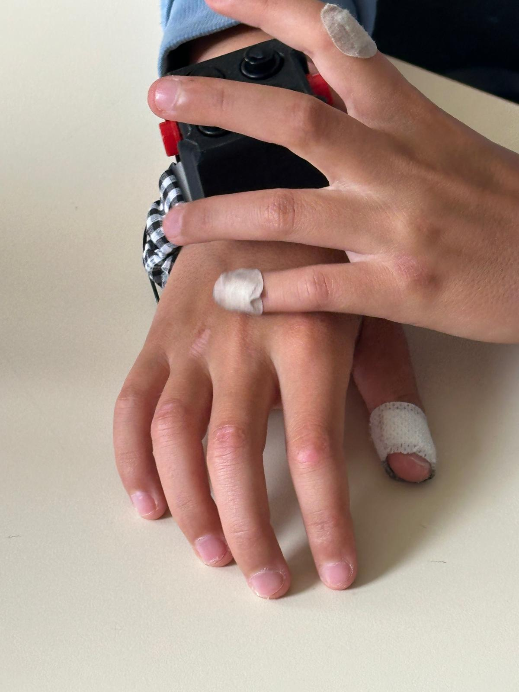

## Conclusie
Connex, de toekomstige armband die blinde en slechtziende kinderen helpt elkaar te vinden op de speelplaats en onderlinge interactie stimuleert.

De armbanden bestaan in setten van vijf waardoor je met vijf personen verbonden bent op de speelplaats. Iedereen draagt een unieke band met ieder zijn eigen kleur en vorm.

Deze knoppen bevatten tactiele vormen waardoor deze knoppen makkelijk te vinden zijn zonder visuele odnersteuning.
Boven en onder de behuizing bevinden er zich nog twee extra drukknoppen voor de armband te bedienen.

Hier nog de functies stap voor stap uitgelgd:

Opmerkingen:
- Er kan maar één stand tegelijk ingeduwd worden.
- Wanneer er iemand aan het zoeken is, kan er met deze persoon niet gecommuniceerd worden.
- Er kan pas een functie uitgeoefend worden als alle knoppen in originele positie staan.

Het finaal prototype werd nog een laatste keer getest door de doelgroep. (N = 2) Vooraf werd het concept nog gerolplayed en op de speelplaats werd het uitgevoerd. D

