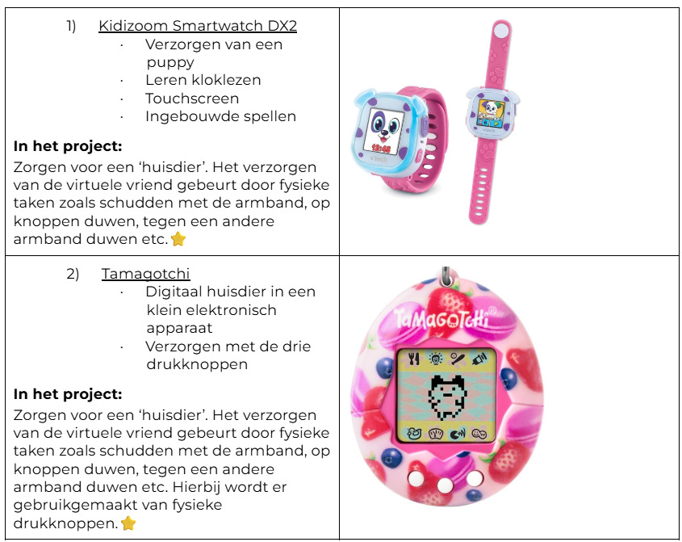
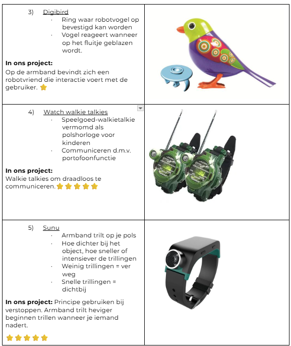

## Develop 1
Deze develop fase werd opgesplitst in twee waves.  Er wordt vertrokken vanuit een storyboard. 

  

v### Functionele breakdown
De functionele breakdown bevat verschillende deelaspecten voor betere grip te krijgen op de architectuur. Deze werden doorheen deze fase opgesteld en bijgewerkt na de testen om duidelijk de verschillende aspecten van het concept te evolueren naar een onderbouwde functionele architectuur.

#### Morfologische Matrix
Voor de testen werden alle mogelijkheden nog eens uitgeschreven per functie om vervolgens de beste combinatie hieruit te maken.

  

#### Productarchitectuur
De productarchitectuur geeft een overzicht van de gebruikte elektronica verwezen naar de armband.

  

#### User flows 
De user flows verduidelijkt de interactie tussen mens en product. Het helpt de gebruiker hoe die stap per stap een handeling moet uitvoeren.

  

#### Informatiearchitectuur
De informatiearchitectuur ordent informatie over het product op een gestructureerde wijze om zo gebruiksgemak en effeciëntie te optimaliseren.

  

#### MVP-definitie
Via de MoSCoW methode werden de primaire en secundaire functies gedefinieerd.

  

### Wave 1
In de definition fase werd er reeds bevestigd dat haptische feedback de manier is om te navigeren. Trillingen vergen namelijk geen visuele ondersteuning en worden ervaren via de zintuigelijke waarnemingen. Dit werd toen vertaald in de vorm van ringen maar wordt in deze wave dieper onderzocht.
[Protocol Wave 1](https://docs.google.com/document/d/1nPsdfydx2fvQFqMQH2k9aMCh4dT-5UrECPmXcozBuiY/edit?usp=sharing) (N=3)
[Rapport Wave 1](https://docs.google.com/document/d/1AFayvt5vMAW4omSunCLhBP_VLpjjSemOP6mUQBEzia4/edit?usp=sharing) (N=3)
#### Doelstellingen
Er werd vertrokken vanuit opgestelde onderzoeksvragen en hypotheses die in deze fase beantwoordt zullen worden.
- Wat is de verkozen manier om de haptische feedback te ontvangen?
*Vermoedelijk niet via de ringen omdat deze veel werk vragen om aan en uit te doen. De trillingen op de pols waarnemen verkiest waarschijnlijk de voorkeur.*

#### Desk Research
Er werd aan benchmarking gedaan van slimme armbanden die ook navigeren met behulp van haptische feedback.

##### Besluiten
- De pols is een goede plaats voor trillingen waar te nemen.
- Uit de benchmarking kunnen er verschillende manieren worden gerealiseerd om deze trillingen over te brengen.

#### Materiaal & methoden

Al de Arduino's bevatten een voorgeprogrameerde route waarbij de trilmotoren in deze volgorde zullen trillen.

#### Gebruikerstesten
De kinderen zullen met elk prototpe de voorgeprogrammeerde route via de prototypes spelenderwijs afleggen, terwijl de onderzoekers een observatieonderzoek doen. Tijdens de testen wordt het Think Aloud Protocol gehanteerd. Achteraf worden deze beoordeeld met de smiley-schaal. 

Ook wordt er vooraf het deel waarbij de kinderen elkaars vorm moeten onthouden gerolplayed. Hierbij wordt er al dan niet bevestigd of de kinderen via dit principe met elkaar kunnen interageren via de armband.
#### Testopzet
De trilmotoren worden op de pols of de vingers bevestigd waarbij de Arduino in een stoffen zakje zich rond de arm bevindt.

#### Doelgroep
|         | Kind A          | Kind B | Kind C |
|-----------------|-------------------------|--------|--------|
| Leeftijd        | 10 jaar                 | 11 jaar | 10 jaar |
| Type blindheid  | Monoculaire blindheid   | Blind | CVI |

#### Resultaten
Via een smiley schaal werden verschillende aspecten beoordeeld.
| Kind   | 1e keuze                | 2e keuze      | 3e keuze                |
|-----------|---------------------|---------------|--------------------------|
| Kind A | Twee armbanden          | Eén armband   | Eén armband met ringen  |
| Kind B | Eén armband met ringen  | Eén armband   | Twee armbanden          |
| Kind C | Eén armband             | Twee armbanden| Eén armband met ringen  |
 
 Werken met één armband verkiest de voorkeur:
 - Twee armbanden waren een te hoge cognitieve belasting.
 - Vingers zijn idealiter vrij tijdens het spelen.

##### Conclusies 
- Trillingen worden door de kinderen algemeen als een geschikte navigatiemethode ervaren.
- Het gebruik van trillingen is inclusief omdat het niet afhankelijk is van zicht en daardoor bruikbaar is voor zowel blinde als slechtziende kinderen.
- Ondanks uiteenlopende voorkeuren blijkt een armband zonder ringen de meest geschikte oplossing.
- Ringen aan de vingers vormen voor slechtziende kinderen een hinder tijdens het spelen en kunnen veiligheidsrisico's veroorzaken doordat ze ergens achter kunnen blijven haken.
- Voor blinde kinderen zijn tactiele kenmerken belangrijk om interacties sneller en intuïtiever te maken.
- De gebruikerstesten tonen aan dat het systeem niet alleen moet navigeren, maar ook feedback moet geven over aankomst en mogelijke obstakels.

##### Implicaties
- Het verdere ontwerp moet vertrekken van een enkele armband zonder ringen als voorkeursconfiguratie.
- Haptische feedback (trillingen) moet behouden en verder uitgewerkt worden als primaire navigatiemethode.
- Er moeten functies worden toegevoegd voor:
het bevestigen van de aankomst op de bestemming;
het waarschuwen voor obstakels tijdens de verplaatsing.
- De invoermethode moet toegankelijker worden gemaakt door
tactiele knoppen met verschillende vormen te voorzien.

#### Wave 2
Het doel van deze tweede wave is het onderzoeken van de reactie en de onderlinge interactie tussen de kinderen bij het testen van de prototypes die gebasseerd zijn op spel. Deze bestaan uit voelbare impulsen en geluidsbeleving. 

[Protocol Wave 2](https://docs.google.com/document/d/1_SrTmNFUYpZebSoyYL-cApbTEUQ2hVBj7rHwhpm2ETI/edit?usp=sharing) (N=2)
[Rapport Wave 2](https://docs.google.com/document/d/1WfAI9g7FnhT1T2cpIMoxWpf2htsGCqGHAacFuqu-JKY/edit?tab=t.0) (N=2)

#### Doelstellingen
Er werd vertrokken vanuit opgestelde onderzoeksvragen en hypotheses die in deze fase beantwoordt zullen worden.
Belangrijk is om het gevoel van de kinderen goed te observeren en nagaan of de onderlinge interactie gestimuleerd wordt.
- Op welke manier kan het spelen en interageren met elkaar beter gestimuleerd worden?
*Onderzoek wat er reeds bestaat m.b.v. benchmarking en vertaal deze speelvormen in prototypes.*
#### Desk Research
De eigenschappen van verschillende reeds bestaande interactief speelgoed/producten werden opgelijst. Het speelgoed is niet gericht voor blinde kinderen maar de principes zouden een inspiratie kunnen zijn. Via voting werden deze vervolgens beoordeeld.

- Er wordt verder gegaan met het principe van de walkie talkies, draadloos communiceren biedt directe interactie aan.
- Het sneller trillen van de trilmotor bij het naderen van een persoon kan het principe vormen van het verstoppertje spelen.

#### Materiaal & methoden

#### Gebruikerstesten
- De usertesten vonden spelenderwijs plaats op de speelplaats, telkens in duo’s.

Zoekspel met Arduino’s:
- Elk kind kreeg een Arduino die met de andere Arduino verbonden was.
- Eén kind verstopte zich, terwijl het andere kind op zoek ging.
- De Arduino gaf trillingen die sneller werden naarmate de kinderen dichter bij elkaar kwamen.
- Tijdens de activiteit werden observaties uitgevoerd en werd het Think Aloud-protocol toegepast.
- Evaluaie m.b.v. de smiley schaal.
- Persoonlijk gesprek plaats om hun ervaringen te bespreken.

Activiteit met walkie talkies:
- De walkie talkies werden eerst geïntroduceerd en kort uitgetest.
- Zelfstandig mee experimenteren op de speelplaats.
- Zoekopdracht uitvoeren met behulp van de walkie talkies.
- Kind A stond op een bepaalde plaats op de speelplaats.
- Kind B probeerde Kind A te vinden door de instructies die via de walkietalkie werden gegeven te volgen.

Belangrijk om het gevoel van de kinderen goed te observeren en nagaan of de onderlinge interactie gestimuleerd wordt.

##### Testopzet
De trilmotor werd bevestigd aan de onderkant van de pols. 
##### Doelgroep
| Kenmerk         | Kind A                  | Kind B |
|-----------------|--------------------------|--------|
| Leeftijd        | 10 jaar                  | 11 jaar |
| Type blindheid  | Monoculaire blindheid    | Blind |
#### Resultaten
Via een smiley schaal werden verschillende aspecten beoordeeld.

Verstopfunctie:
| Vraag                     | Kind A | Kind B |
|---------------------------|--------|--------|
| Trillingen duidelijk?     | 5/5    | 5/5    |
| Trillingen aangenaam?     | 3/5    | 1/5    |
| Leuk?                     | 5/5    | 5/5    |
| Voor herhaling vatbaar?   | 5/5    | 5/5    |
| Algemene score?           | 5/5    | 5/5    |
- De trillingen werden door de proefpersonen als te zacht ervaren.
- De resultaten uit tabel 1 bevestigen dat de trillingssterkte een aandachtspunt is.
- Het spel stimuleerde veel sociale interactie tussen de kinderen.
- De functie was zeer toegankelijk en waardevol voor het blinde kind.
- Voor het slechtziende kind werd de functie eerder gezien als een extra meerwaarde dan als een noodzakelijke ondersteuning.
- Het concept werd positief onthaald en draagt bij aan een speelse en inclusieve speelervaring.

Walkie talkie:
| Vraag                     | Kind A | Kind B |
|---------------------------|--------|--------|
| Makkelijk te verstaan?     | 4/5    | 5/5    |
| Makkelijk te bedienen?     | 5/5    | 5/5    |
| Leuk?                     | 5/5    | 5/5    |
| Voor herhaling vatbaar?   | 5/5    | 5/5    |
| Algemene score?           | 5/5    | 5/5    |
- De testpersonen konden eenvoudig met elkaar communiceren.
- Dankzij de communicatie vonden de kinderen elkaar snel terug.
- De functie ondersteunde een vlotte samenwerking tussen de kinderen.
- De communicatievorm werd als gebruiksvriendelijk ervaren.
- De test toont aan dat audiocommunicatie een effectieve manier is om contact en interactie te bevorderen.

##### Conclusies & implicaties
- Zowel het zoekspel met trillingen als de walkie talkie functie functioneren goed en stimuleren sociale interactie tussen blinde en slechtziende kinderen.
- De kinderen begrepen beide systemen snel en konden ze zonder problemen gebruiken.
- De huidige trillingssterkte bleek soms te zwak, waardoor de feedback niet altijd optimaal waarneembaar was.
- Audiocommunicatie blijkt een zeer effectieve manier om samenwerking en sociale interactie te ondersteunen.
- Beide functies werden door de testpersonen zeer positief geëvalueerd en zouden opnieuw gebruikt willen worden.
##### Implicaties
- Zowel haptische feedback als audiocommunicatie moeten behouden blijven als kernonderdelen van het ontwerp.
- De trillingssterkte moet in de volgende ontwikkelfase verhoogd of aangepast worden zodat signalen duidelijker voelbaar zijn.
- Het zoekspel met trillingen kan verder ontwikkeld worden als een extra speelse functie die sociale interactie bevordert.
- De walkie-talkie functie is voldoende gevalideerd en kan geïntegreerd worden in het definitieve ontwerp van de armband.
- Omdat beide interactievormen toegankelijk blijken voor zowel blinde als slechtziende kinderen, kunnen ze als inclusieve oplossingen verder worden uitgewerkt.

