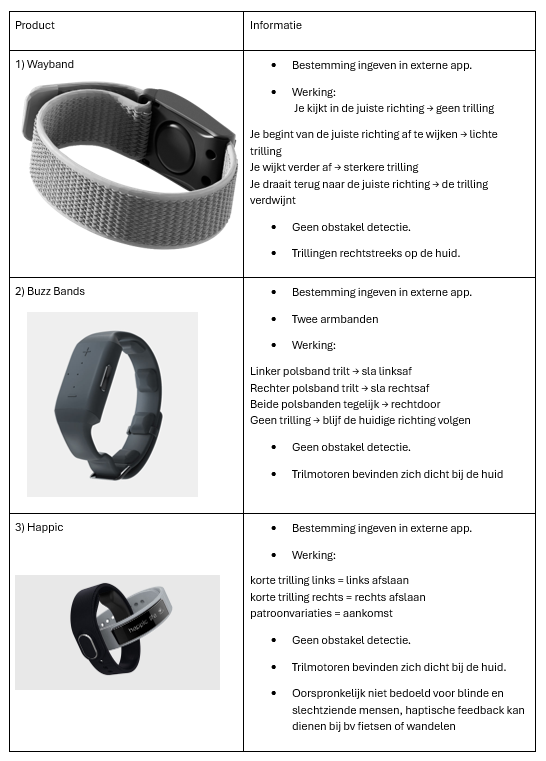
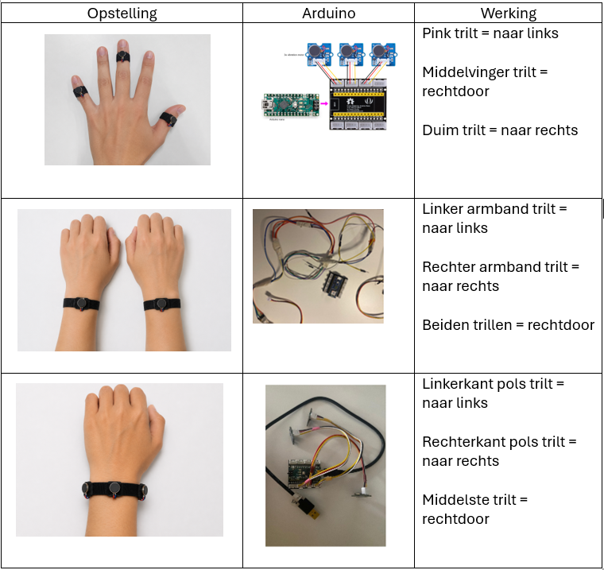
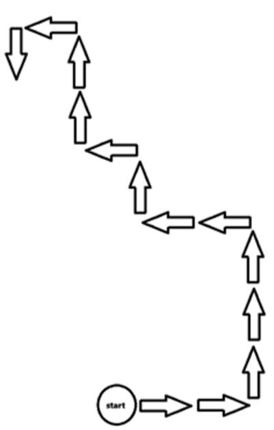

## Develop 1
Deze develop fase werd opgesplitst in twee waves.  Er wordt vertrokken vanuit een storyboard. 

  

### Wave 1
In de definition fase werd er reeds bevestigd dat haptische feedback de manier is om te navigeren. Trillingen vergen namelijk geen visuele ondersteuning en worden ervaren via de zintuigelijke waarnemingen. Dit werd toen vertaald in de vorm van ringen maar wordt in deze wave dieper onderzocht.
[Protocol Wave 1](https://docs.google.com/document/d/1nPsdfydx2fvQFqMQH2k9aMCh4dT-5UrECPmXcozBuiY/edit?usp=sharing) (N=3)
[Rapport Wave 1](https://docs.google.com/document/d/1AFayvt5vMAW4omSunCLhBP_VLpjjSemOP6mUQBEzia4/edit?usp=sharing) (N=3)
#### Doelstellingen
Er werd vertrokken vanuit opgestelde onderzoeksvragen en hypotheses die in deze fase beantwoordt zullen worden.
- Wat is de verkozen manier om de haptische feedback te ontvangen?
*Vermoedelijk niet via de ringen omdat deze veel werk vragen om aan en uit te doen. De trillingen op de pols waarnemen verkiest waarschijnlijk de voorkeur.*

#### Desk Research
Er werd aan benchmarking gedaan van slimme armbanden die ook navigeren met behulp van haptische feedback.

##### Conclusies
- De pols is een goede plaats voor trillingen waar te nemen.
- Uit de benchmarking kunnen er verschillende manieren worden gerealiseerd om deze trillingen over te brengen.

#### Materiaal & methoden

Al de Arduino's bevatten een voorgeprogrameerde route waarbij de trilmotoren in deze volgorde zullen trillen.

### Gebruikerstesten
De kinderen zullen met elk prototpe de voorgeprogrammeerde route via de prototypes spelenderwijs afleggen, terwijl de onderzoekers een observatieonderzoek doen. Tijdens de testen wordt het Think Aloud Protocol gehanteerd. Achteraf worden deze beoordeeld met de smiley-schaal. 

Ook wordt er vooraf het deel waarbij de kinderen elkaars vorm moeten onthouden gerolplayed. Hierbij wordt er al dan niet bevestigd of de kinderen via dit principe met elkaar kunnen interageren via de armband.
#### Testopzet
De trilmotoren worden op de pols of de vingers bevestigd waarbij de Arduino in een stoffen zakje zich rond de arm bevindt.

#### Doelgroep
|         | Kind A          | Kind B | Kind C |
|-----------------|-------------------------|--------|--------|
| Leeftijd        | 10 jaar                 | 11 jaar | 10 jaar |
| Type blindheid  | Monoculaire blindheid   | Blind | CVI |

### Resultaten
| Kind   | 1e keuze                | 2e keuze      | 3e keuze                |
|-----------|---------------------|---------------|--------------------------|
| Kind A | Twee armbanden          | Eén armband   | Eén armband met ringen  |
| Kind B | Eén armband met ringen  | Eén armband   | Twee armbanden          |
| Kind C | Eén armband             | Twee armbanden| Eén armband met ringen  |
 
 Werken met één armband verkiest de voorkeur:
 - Twee armbanden waren een te hoge cognitieve belasting.
 - Vingers zijn idealiter vrij tijdens het spelen.
 
[Protocol Wave 1](https://docs.google.com/document/d/1nPsdfydx2fvQFqMQH2k9aMCh4dT-5UrECPmXcozBuiY/edit?usp=sharing) (N=3)
[Rapport Wave 1](https://docs.google.com/document/d/1AFayvt5vMAW4omSunCLhBP_VLpjjSemOP6mUQBEzia4/edit?usp=sharing) (N=3)

##### Conclusies & implicaties
De kinderen vonden algemeen de trillingen een goede manier om te navigeren. Dit is een visueel onafhankelijke oplossing en kan door iedereen gebruikt worden. Wel waren de meningen sterk verdeeld waardoor er wordt gegaan voor de optie die niemand als minst beste ervaarde namelijk één armband zonder ringen. De ringen zijn voor de slechtziende kinderen een te grote last aan de vingers tijdens het fysiek bewegen op de speelplaats en kunnen ook blijven hangen aan iets waardoor dit gevaarlijker is. Daarom is dit geen goede optie ondanks het voor het blinde kind, dat iets rustiger is op de speelplaats, wel de favoriete was. 
Uit de analyse zijn het bevestigen van de aankomst en het waarschuwen van obstakels zaken waar rekening mee gehouden moet worden in de volgende fases.

Bij het rolplayen werd er vastgesteld om voor de blinde kinderen niet alleen gekleurde knoppen te voorzien waarbij de kleur wordt voorgelezen bij het indrukken, maar ook tactiele knoppen met elke knop een specifieke vorm. Op die manier kunnen zij ook makkelijker personen ingeven in de armband zonder eerst alle opties te moeten doorlopen.

#### Wave 2
Het doel van deze tweede wave is het onderzoeken van de reactie en de onderlinge interactie tussen de kinderen bij het testen van de prototypes. Deze zijn gebaseerd op voelbare impulsen en geluidsbeleving. Belangrijk is om het gevoel van de kinderen goed te observeren en nagaan of de onderlinge interactie gestimuleerd wordt.

[Protocol Wave 2](https://docs.google.com/document/d/1_SrTmNFUYpZebSoyYL-cApbTEUQ2hVBj7rHwhpm2ETI/edit?usp=sharing) (N=2)
[Rapport Wave 2](https://docs.google.com/document/d/1WfAI9g7FnhT1T2cpIMoxWpf2htsGCqGHAacFuqu-JKY/edit?tab=t.0) (N=2)

- Op welke manier kan het spelen en interageren met elkaar beter gestimuleerd worden?
*Onderzoek wat er reeds bestaat m.b.v. benchmarking en vertaal deze speelvormen in prototypes.*
##### Prototypes
Verschillende opties werden overwogen en getest via walkie talkies en Arduino.

##### Conclusies & implicaties
Uit de testen blijkt dat beide functies , het zoekspel met trillingen en de walkie-talkie, goed werken en duidelijk sociale interactie tussen de kinderen stimuleren.
Bij het zoekspel begrepen beide kinderen snel hoe het systeem werkte. De trillingen hielpen hen om elkaar te lokaliseren en het spel leidde tot veel enthousiasme en interactie. De testpersonen gaven aan dat ze het spel leuk vonden en opnieuw zouden willen spelen (5/5). De trillingen waren volgens hen wel wat te zacht, wat een belangrijk aandachtspunt is. De trillingen minder intens maken was een goede oefening maar bleek niet zo nodig als gedacht. Voor het blinde kind was deze functie zeer toegankelijk en bruikbaar. Algemeen werd dit eerder als een extra spelvorm gezien dan als een noodzakelijk hulpmiddel.
De walkie-talkie functie werkte zeer vlot. De kinderen konden gemakkelijk met elkaar communiceren en vonden elkaar snel via verbale instructies. Ook hier waren de scores zeer positief: beide kinderen vonden het leuk en voor herhaling vatbaar (5/5). Dit toont aan dat communicatie via geluid een sterke manier is om samenwerking en interactie te stimuleren. Een geslaagde test dus! 
Op basis van deze test kan geconcludeerd worden dat zowel haptische feedback (trillingen) als audiocommunicatie geschikte interactievormen zijn voor blinde en slechtziende kinderen. Beide functies zorgen voor spelenderwijs contact en samenwerking tussen de kinderen. Voor de verdere ontwikkeling is het vooral belangrijk om de trillingssterkte terug aan te passen, zodat de feedback nog duidelijker waarneembaar is. De walkie-talkie functie is voldoende gevalideerd en zal geïntegreerd worden in de armband.

### Functionele breakdown
De functionele breakdown bevat verschillende deelaspecten voor betere grip te krijgen op de architectuur. Deze werden doorheen deze fase opgesteld en bijgewerkt na de testen om duidelijk de verschillende aspecten van het concept te evolueren naar een onderbouwde functionele architectuur.

#### Morfologische Matrix
Voor de testen werden alle mogelijkheden nog eens uitgeschreven per functie om vervolgens de beste combinatie hieruit te maken.

  

#### Productarchitectuur
De productarchitectuur geeft een overzicht van de gebruikte elektronica verwezen naar de armband.

  

#### User flows 
De user flows verduidelijkt de interactie tussen mens en product. Het helpt de gebruiker hoe die stap per stap een handeling moet uitvoeren.

  

#### Informatiearchitectuur
De informatiearchitectuur ordent informatie over het product op een gestructureerde wijze om zo gebruiksgemak en effeciëntie te optimaliseren.

  

#### MVP-definitie
Via de MoSCoW methode werden de primaire en secundaire functies gedefinieerd.

  

