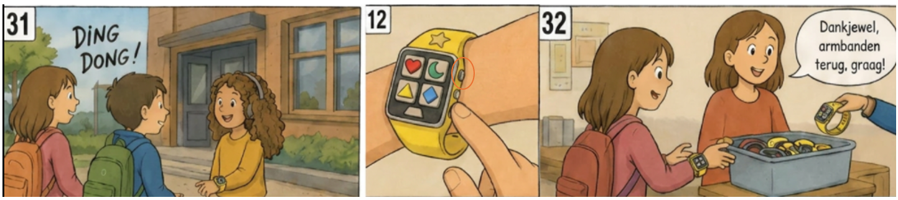

### Develop 2
In deze fase wordt er weer vertrokken vanuit een storyboard.

*   [Protocol](https://docs.google.com/document/d/1UPgJKpPowbs-d-nndVgMRzp1pptnUT6lB6xNUvCXEwo/edit?usp=sharing)
  * [Rapport](https://docs.google.com/document/d/17CZ-qlhVTWKxYnFFfxX93lt-I04BnHg_nRmLgqNz79U/edit?usp=sharing)
#### Functionele breakdown
##### Cognitieve & sensoriële ergonomie
Het ontwerp werd onderbouwd met verschillende principes zoals de 7 stages of action, Gestaltwetten en signifiers. Hieruit blijkt dat duidelijke feedback (zowel tactiel als auditief) cruciaal is en dat interacties zo intuïtief mogelijk moeten zijn.

Knoppen moeten onmiddellijk begrijpbaar zijn en fouten moeten geminimaliseerd worden door het ontwerp zelf.
###### 7 stages of action
1) Goal: Ik zoek mijn vriendin op de speelplaats.
2) Plan: Via de slimme armbanden kunnen we elkaar vinden of ik ga naar de leerkracht om hulp te vragen
3) Specify: Ik kies voor de armband omdat ik via deze manier zelfstandig mijn vriendin kan vinden door haar symbool in te geven. Haar symbool is een ster.
4) Perform: Ik duw op de navigatieknop en vervolgens voel ik over de knoppen tot ik de ster voel. Deze knop duw ik in. Deze knoppen blijven heel de tijd ingedrukt
5) Perceive: Ik neem waar dat de armband begint te trillen
6) Interpret: 
Rechterkant trilt => ik moet naar rechts
Linkerkant trilt => ik moet naar links
Bovenkant trilt => ik moet rechtdoor
Armband blijft trillen => ik ben dicht bij mijn vriendin
7) Compare: Ik heb mijn vriendin gevonden, door de ster weer in te drukken en deze terug verspringt naar de originele stand, stopt het trillen.
###### Gestalt-wetten

##### Signifiers

#### Doelstellingen
In deze fase ligt de focus op het optimaliseren van de ergonomie en gebruiksvriendelijkheid van de armband. Waar in Develop 1 de functionele werking centraal stond, wordt hier onderzocht hoe het product fysiek en cognitief ervaren wordt door de gebruiker.

Er werd vertrokken vanuit centrale vragen en hypotheses die in deze fase beantwoordt zullen worden.

- Wat zijn de ideale afmetingen van het product voor optimaal gebruik?
*Om hier antwoord op te krijgen moet er gedaan worden aan benchmarking van verschillende kinderarmbanden en antropometrisch onderzoek naar de hand- en polsafmetingen van kinderen.*

- Op welke manier is de armband het beste sluitbaar?
*Om hier antwoord op te krijgen moet er gedaan worden aan benchmarking van verschillende sluitingsmechanismes van horloges en deze vervolgens testen in een user test.*
#### Desk Research
Onderstaande tabel geeft een overzicht van de te onderzochten data voor antwoord te krijgen op de verschillende aspecten van de armband.

- Polsomtrek

- Oppervlakte vingertoppen

- Polsbreedte

   - De gemiddelde breedte van display is 36 mm
   - De gemiddelde hoogte is 43 mm
   - De gemiddelde massa is 60 gram
- Polsdikte

Uit de verschillende berekeningen was de totale standaardafwijking:
σ = 0,45 cm.

##### Besluiten

#### Materiaal & methoden
##### Knoppen
Onderstaande knoppen voldoen aan de onderzochte minimale grootte van het knopoppervlak.

Daarnaast is er ook een display gerealiseerd die voldoet aan de onderzochte afmetignen hiervan.

De knoppen bevatten velcro waardoor deze eenvoudig te bevestigen zijn op de armband. Dit zorgt voor een modulair prototype.

##### Armbandsluitingen
Deze types werden getest bij de gebruikers. 

#### Gebruikerstesten
- De prototypes worden getest in de echte gebruikscontext: de speelplaats.
- Kinderen voelen eerst de knoppen en raden vervolgens welke vorm ze voorstellen; de herkenningstijd wordt gemeten.
- Er wordt feedback verzameld over de duidelijkheid en grootte van de knoppen, ondersteund door het Think Aloud-protocol.
- Verschillende sluitingsmechanismen worden getest op zelfstandige bruikbaarheid en mogelijke fouten tijdens het aandoen.
- Vooraf werd er gerolplayed waarbij aan elk kind een vorm werd toegewezen.
- In een speelse opdracht lopen de kinderen rond op de speelplaats en moeten ze bij het horen van een naam de juiste vormknop indrukken.
- In een snelheidstest moeten de kinderen zo snel mogelijk de gevraagde vorm terugvinden om het tactiele onderscheid tussen de knoppen te evalueren.
##### Testopzet

Er werd gewerkt met een modulair armbandconcept via velcro met verschillende varianten.

##### Doelgroep
|                | Kind A                 | Kind B | Kind C | Kind D                 |
|----------------|------------------------|--------|--------|------------------------|
| Leeftijd       | 10 jaar                | 10 jaar | 10 jaar | 10 jaar                |
| Type blindheid | Monoculaire blindheid | CVI    | CVI    | Monoculaire blindheid |

#### Resultaten
- Knoppen

| Type knop   | Tijd (s) |
|------------|---------|
| Grote knop - groot symbool | 20–34   |
| Kleine knop - klein symbool| 2–7     |

- Armbandsluitingen

| Rang | Kind A | Kind B | Kind C | Kind D |
|-------|--------|--------|--------|--------|
| 1 | Magneetsluiting | Magneetsluiting | Gesp met pin | Magneetsluiting |
| 2 | Gesp met pin | Bandsluiting met gespknopjes | Magneetsluiting | Gesp met pin |
| 3 | Bandsluiting met gespknopjes | Gesp met pin | Bandsluiting met gespknopjes | Bandsluiting met gespknopjes |
| 4 | Kliksysteem | Kliksysteem | Kliksysteem | Kliksysteem |

##### Conclusies
- Grote knoppen zijn comfortabeler en eenvoudiger in gebruik.
- Kleine, duidelijke symbolen worden sneller tactiel herkend.
- Eenvoudige tactiele vormen zijn het meest effectief.
- Duidelijke feedback is noodzakelijk om de gebruiker te bevestigen dat een actie is uitgevoerd.
- Knoppen moeten goed van elkaar te onderscheiden zijn om verwarring en fouten te voorkomen.
- De magneetsluiting is de populairste sluiting.
- Het kliksysteem is de minst geliefde optie.
- Er is een duidelijke voorkeur voor sluitingen die eenvoudig en intuïtief te gebruiken zijn.
- De armband heeft een verstelbare bandlengte tussen 13,78 cm en 16,76 cm, zodat deze geschikt is voor verschillende polsomtrekken van kinderen.
- De drukknoppen hebben een afmeting tussen 13 mm en 25 mm in de mate dat mogelijk is. 
- De onderlinge afstand tussen de knoppen varieert tussen 8 mm en 13 mm
- Het display heeft een afmeting van 35 mm breed en 45 mm hoog. 
- De trilmotor heeft een diameter van 1 cm en bevindt zich ongeveer 
1,42 cm van de pols langs beide kanten. 

##### Implicaties
- Gebruik voldoende grote drukknoppen voor een comfortabele bediening.
- Voorzie elke knop van een klein, eenvoudig en duidelijk tactiel symbool.
- Kies voor herkenbare basisvormen.
- Integreer directe feedback, bijvoorbeeld via trillingen, geluid of een klikmechanisme.
- Zorg voor voldoende afstand en een duidelijk voelbaar onderscheid tussen de knoppen.
- Vermijd complexe patronen of kleine details die moeilijk tactiel waarneembaar zijn.
- De magneetsluiting wordt geselecteerd als voorkeursoplossing voor verdere ontwikkeling van de armband.
- Het ontwerp moet focussen op gebruiksgemak, snelle bevestiging, 

Uit deze conclusies werd een beter beeld van het product geschetst.

