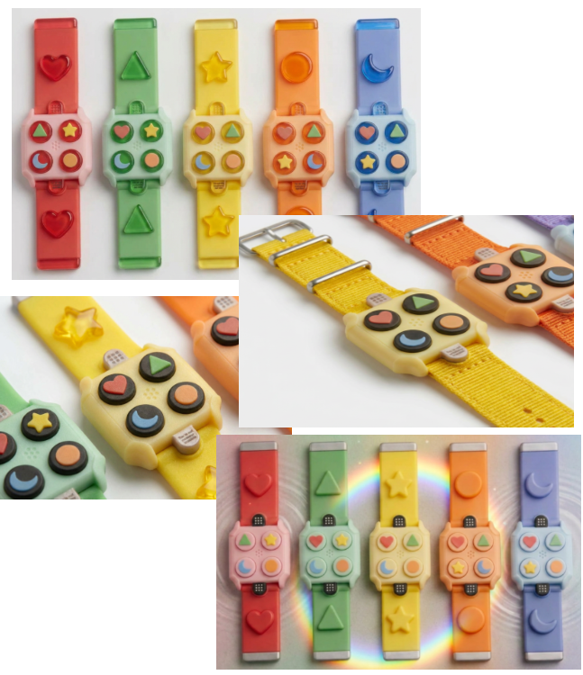

### Develop 3
In deze fase wordt er weer vertrokken vanuit een storyboard.

*   [Protocol](https://docs.google.com/document/d/18HNSmozHtuKRnYnk4I5-nij3c2kGfG_J2HKYK2Kf9bY/edit?usp=sharing)
  * [Rapport](https://docs.google.com/document/d/1sv93BTVeYQTfUqAkyKskHxLJA1h6l4gMxU6TwHaVik8/edit?usp=sharing)
#### Functionele breakdown

##### CMF-analyse

##### Besluiten

#### Doelstellingen
In deze laatste develop fase wordt er onderzoek gedaan naar de emoties, ervaringen, vorm en gebruik met het product. Zo zal er een CMF analyse worden opgesteld om hieruit de beste design besluiten te kunnen maken. 
Het doel is op het einde van deze fase een product te bekomen dat zowel functioneel als emotioneel overtuigt.

#### Materiaal & methoden
- Banden:

- Tactiele knoppen:

##### Besluiten
- Kunsthars was de favoriet omdat deze sterk en glad aanvoelde. 
- Kunsthars voelde heel aangenaam.
- Andere banden waren elastischer en minder stevig en gaven een minder kwalitatieve gevoel
- De resin figuren waren makkelijker te herkennen door de scherpere randen en de nauwkeurigere details
- Deze randen mogen niet te scherp zijn
- De siliconen werd algemeen comfortabeler beschouwd
- Het duurde langer om de siliconen vormen te herkennen
- Bij de siliconen werden er meer fouten gemaakt

#### Gebruikerstesten
- De prototypes worden getest in de echte gebruikscontext: de speelplaats.
- Kinderen voelen eerst de knoppen en raden vervolgens welke vorm ze voorstellen; de herkenningstijd wordt gemeten.
- Er wordt feedback verzameld over de duidelijkheid en grootte van de knoppen, ondersteund door het Think Aloud-protocol.
- Verschillende sluitingsmechanismen worden getest op zelfstandige bruikbaarheid en mogelijke fouten tijdens het aandoen.
- Vooraf werd er gerolplayed waarbij aan elk kind een vorm werd toegewezen.
- In een speelse opdracht lopen de kinderen rond op de speelplaats en moeten ze bij het horen van een naam de juiste vormknop indrukken.
- In een snelheidstest moeten de kinderen zo snel mogelijk de gevraagde vorm terugvinden om het tactiele onderscheid tussen de knoppen te evalueren.
##### Testopzet
- Horloges
De kinderen testten verschillende horloges in de klas door ze te voelen, te vergelijken en daarna te dragen. Ze gaven feedback over display en knoppen en vulden achteraf een smiley-schaal in.

- Tactiele vormen:
De vormen werden op de speelplaats getest. Kinderen voelden en raadden de vormen, gaven feedback (met Think Aloud), en hun responstijd werd gemeten. Daarna deden ze een speelse knoppentaak. Ook hier eindigde de test met een smiley-schaal.

##### Doelgroep
|                | Kind A      | Kind B      |
|----------------|-------------|-------------|
| Leeftijd       | 10 jaar     | 10 jaar     |
| Type blindheid | CVI         | Slechtziend |

#### Resultaten
- Banden

- Tactiele knoppen

##### Conclusies
- Kunsthars (resin) heeft de voorkeur boven siliconen doordat het steviger, gladder en kwalitatiever aanvoelt.
- Resin-vormen zijn sneller en nauwkeuriger herkenbaar dankzij de scherpere randen en fijnere details.
- Te scherpe randen moeten vermeden worden, omdat deze het comfort kunnen verminderen.
- Siliconen wordt als comfortabeler ervaren, maar de vormen zijn moeilijker te herkennen.
- Bij siliconen werden meer herkenningsfouten gemaakt en duurde de identificatie van vormen langer.
- Gebruikers geven de voorkeur aan stevige kunststoffen boven elastische materialen.
- Een duidelijk kleurcontrast tussen de vormen, de achtergrond en de drukknop ondersteunt de visuele herkenning.
- Goede grip is essentieel om stabiliteit en gebruiksgemak tijdens het spelen te garanderen.
##### Implicaties
- Kies kunsthars of een vergelijkbare stevige kunststof als basismateriaal voor de vormen.
- -Voorzie de vormen van voldoende afgeronde randen zodat ze comfortabel blijven zonder verlies van tactiele herkenbaarheid.
- Ontwerp vormen met duidelijke details en goed voelbare contouren voor snelle en correcte identificatie.
- Gebruik hoog kleurcontrast tussen verschillende onderdelen om de visuele toegankelijkheid te verbeteren.
- Voorzie een oppervlak of afwerking met voldoende grip om verschuiven tijdens gebruik te voorkomen.
- Het gekozen materiaal moet voldoen aan de volgende functionele eisen:
waterdicht, licht flexibel zonder vormverlies, comfortabel in gebruik,
duurzaam, krasbestendig, lichtgewicht en stootvast.

